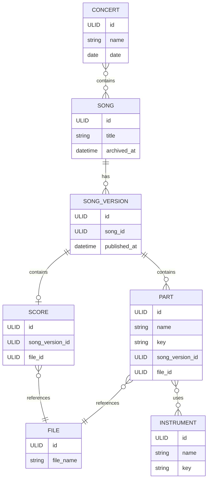

# Domain Model



```markdown
## Design notes

- `Song` represents a musical work in the library.
- `SongVersion` represents a version of a song and is the unit of publication.
- `Score` represents the full score for a song version.
- `Part` represents an individual part for a song version.
- `File` contains metadata about a stored file, while the actual file contents are managed by the file storage implementation.
- A `Part` can be associated with multiple `Instrument` records.
- A `Concert` consists of a set of `Song` records.
```
