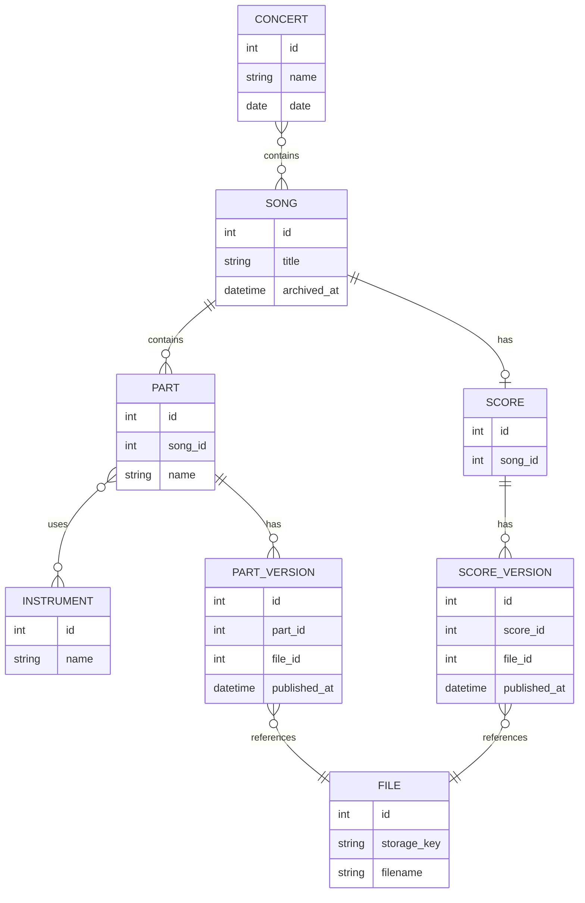

# Domain Model



```markdown
## Design notes

- `Song` represents a musical work in the library.
- `Score` represents the full score for a song and is optional.
- `Part` represents an individual part for a song.
- `PartVersion` and `ScoreVersion` keep track of published versions of
  the corresponding material.
- `File` represents the physical file stored in object storage and is
  kept separate from the domain metadata.
- A `Part` can be associated with multiple `Instrument` records.
- A `Concert` consists of a set of `Song` records.
```
